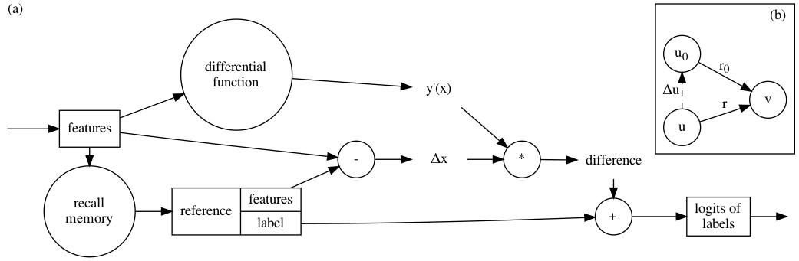

# Memory-Associated Differential Learning



*Memory-Associated Differential Learning (MAD Learning)* learns the differential function among data rather than the mapping from inputs to outputs.

It is a flexible learning paradigm that can be applied to unary situations (Image Recognition), binary situations (Link Prediction) and ternary situations (Knowledge Graphs).

Currently, MAD Learning achieves competitive performance on [obgl-ddi](https://ogb.stanford.edu/docs/leader_linkprop/#ogbl-ddi).

## Reproducibility

### Weekday Prediction Challenge

Run the following command to experiment MAD Learning in Weekday Prediction Challenge

```bash
python3 weekday.py
```

You may edit the `weekday.py` file from line 116 to line 126 to modify the hyperparameters of MAD Learning or conduct this experiment with MLP.

### Image Recognition

```bash
python3 cifar_mnist.py cifar10 conv
```

The third and fourth parameters are dataset and method.

* available datasets: cifar10 / cifar100 / mnist / kmnist
* available methods: conv / resnet / mad-conv /mad-resnet

### Zachary's Karate Club

To generate a series of points representing Zachary's Karate Club, run

```bash
python3 karate.py
```

### Link Prediction

To predict links on `ogbl-ddi`, run `python3 ogbl-ddi.py`.

To predict links on Cora, Citeseer or Pubmed, edit file `citations.py` to set the dataset name at line 11 and run it.

## Citation

```bibtex
@article{2102.05246v1,
  author = {Yi Luo and Aiguo Chen and Bei Hui and Ke Yan},
  eprint = {2102.05246v1},
  month = {Feb},
  title = {Memory-Associated Differential Learning},
  type = {article},
  url = {http://arxiv.org/abs/2102.05246v1},
  year = {2021},
}
```
